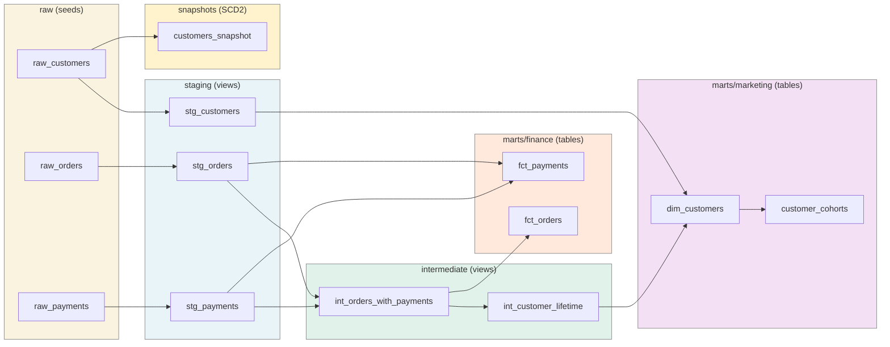

# dbt Local Warehouse

> A complete dbt project on DuckDB demonstrating analytics engineering: layered models (staging → intermediate → marts), generic and singular tests, SCD Type 2 snapshots, reusable macros, and dbt docs auto-deployed to GitHub Pages.

[](https://github.com/wxssxm/dbt-local-warehouse/actions/workflows/ci.yml)
[](https://www.getdbt.com/)
[](https://duckdb.org/)
[](LICENSE)
[](https://wxssxm.github.io/dbt-local-warehouse/)

A jaffle-shop-flavoured warehouse you can `dbt build` and explore in under a minute. The project is intentionally small in volume but complete in shape: every layer of a real analytics-engineering stack is represented, with tests at the source, model, and column levels, plus a few cross-mart singular checks.

## Live docs

The full lineage graph, model descriptions, column docs, and test catalog are deployed on every push to `main`:

🔗 **https://wxssxm.github.io/dbt-local-warehouse/**

## Architecture



## Stack

| Layer | Technology |
| --- | --- |
| Engine | [DuckDB](https://duckdb.org) (file-based for dev, in-memory for CI) |
| Transformations | [dbt-core 1.9](https://www.getdbt.com/) + [dbt-duckdb 1.9](https://github.com/duckdb/dbt-duckdb) |
| Test packages | [dbt_utils](https://github.com/dbt-labs/dbt-utils), [dbt_expectations](https://github.com/calogica/dbt-expectations) |
| Lint | [sqlfluff 3.2](https://sqlfluff.com/) with the dbt templater |
| Packaging | [uv](https://docs.astral.sh/uv/) |
| CI | GitHub Actions: dbt deps + lint + build + static docs + Pages deploy |
| Docs | dbt docs (single-file `static_index.html`) deployed to GitHub Pages |

## Quickstart

```bash
git clone https://github.com/wxssxm/dbt-local-warehouse.git
cd dbt-local-warehouse
cp .env.example .env

make install     # uv venv + dbt-duckdb + sqlfluff
make build       # dbt deps + dbt build (seed, run, test, snapshot)
make docs        # generate + serve docs at http://localhost:8080
```

`make build` runs **77 nodes** end-to-end on DuckDB:

- 3 seeds (raw layer)
- 8 models (staging, intermediate, marts)
- 1 snapshot (SCD2)
- 65 tests (generic + singular + dbt-expectations)

…in roughly 5 seconds locally.

## Project layout

```
dbt-local-warehouse/
├── seeds/
│   ├── raw_customers.csv      # 50 rows
│   ├── raw_orders.csv         # 200 rows
│   └── raw_payments.csv       # 213 rows
├── models/
│   ├── staging/               # views over raw, light cleanup
│   ├── intermediate/          # views joining staging
│   └── marts/
│       ├── finance/           # fct_orders, fct_payments
│       └── marketing/         # dim_customers, customer_cohorts
├── snapshots/
│   └── customers_snapshot.sql # SCD2 on email/first/last_name
├── tests/                     # 3 singular SQL tests
├── macros/
│   ├── cents_to_euros.sql
│   └── generate_schema_name.sql
├── analyses/
├── dbt_project.yml            # one source of truth for materialization + schemas
├── packages.yml               # dbt_utils, dbt_expectations
├── profiles.yml               # dev (file) + ci (in-memory) targets
├── .sqlfluff                  # dbt-templated lint rules
└── scripts/generate_seeds.py  # reproducible CSV generator
```

## Highlights

### Layered modelling (Kimball-flavoured)

- **Staging** — one view per source table, light renames + casts. Materialized as views so they always reflect the latest seed state without rebuild cost.
- **Intermediate** — joins, but no business logic. Not exposed as marts.
- **Marts** — physical tables, tagged by business domain (`finance`, `marketing`). Stable contracts the BI layer depends on.

### Tests at every level

| Type | Examples | Where |
| --- | --- | --- |
| Generic — built-in | `unique`, `not_null`, `accepted_values`, `relationships` | every model + sources |
| Generic — dbt_utils | `expression_is_true` (`amount_cents >= 0`, `orders_count >= 1`) | sources, intermediate, marts |
| Generic — dbt_expectations | `expect_column_values_to_match_regex` (email), `expect_column_values_to_be_between` (signup_date, payment EUR) | staging |
| Singular SQL | Cross-mart equality (`fct_orders.total = sum(fct_payments)`), data contract (`payment ≤ 250 EUR`), segment consistency | `tests/` |

### SCD Type 2 snapshot

`customers_snapshot` uses the `check` strategy on `email | first_name | last_name`. Re-running `dbt snapshot` after a customer email change creates a new history row with `dbt_valid_from` / `dbt_valid_to` timestamps; hard-deletes are also tracked thanks to `invalidate_hard_deletes: true`.

### Reusable macros

- `cents_to_euros(column)` — used by `stg_payments` to derive `amount_eur` from `amount_cents` with consistent rounding. Centralising the conversion avoids drift between models.
- `generate_schema_name` overrides dbt's default behaviour so `+schema: raw` produces a schema named `raw` rather than `<target>_raw` — cleaner names and a 1:1 match with `sources.yml`.

### CI deploys the docs

A single workflow handles lint → build → docs → Pages on every push to `main`:

```yaml
- run: uv run dbt deps
- run: uv run sqlfluff lint models/
- run: uv run dbt build --target ci --fail-fast    # in-memory DuckDB
- run: uv run dbt docs generate --static --target ci
- uses: actions/upload-pages-artifact@v3
- uses: actions/deploy-pages@v4                    # gated to main
```

Live URL: <https://wxssxm.github.io/dbt-local-warehouse/>

## Selectors cheat sheet

```bash
# Build everything
dbt build

# Just one mart and its parents
dbt build --select +fct_orders

# All finance models
dbt build --select tag:finance

# Everything downstream of stg_payments
dbt build --select stg_payments+

# Test-only run on the marketing tag
dbt test --select tag:marketing
```

## Sample query (after `make build`)

```sql
-- jaffle.duckdb
select
    customer_segment,
    count(*) as customers,
    round(avg(lifetime_revenue_eur), 2) as avg_ltv_eur,
    round(avg(orders_count), 2) as avg_orders
from marts.dim_customers
group by 1
order by avg_ltv_eur desc;
```

## Roadmap

- [ ] Incremental materialization on `fct_payments` (with `unique_key=payment_id`)
- [ ] `dbt source freshness` check on the seed mtimes (or a real source)
- [ ] Exposures for the BI layer (Metabase / Superset)
- [ ] `dbt-coverage` to track docs/test coverage over time
- [ ] Explicit contracts (`contract: enforced`) on marts

## License

MIT — see [LICENSE](LICENSE).

## Author

**Wassim Fayala** — Data Engineer apprenti @ La Forge (Paris)

[LinkedIn](https://www.linkedin.com/in/wassim-fayala/) · wassimfayala2@gmail.com
